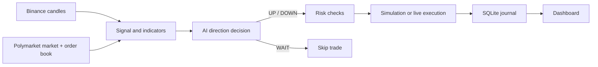

<div align="center">

# Polymarket BTC 15m AI Trading Agent

**AI-assisted direction trading for Polymarket BTC 15-minute binary markets**

[中文](README.zh-CN.md) · [Packaging](PACKAGING.md)


</div>

> [!WARNING]
> This software can place real-money orders. Start with `SIMULATION_MODE=true`.
> Binary-market positions can lose 100% of their notional value.

## Observed Model Performance

<div align="center">
  
</div>

| Model | Observed directional win rate | Status |
|---|---:|---|
| **Claude** | **90%** | Current Claude-compatible decision path |
| **Gemini** | **75%** | Comparative observation; no native adapter in this release |

> The figures above are user-provided observations. Dataset, sample size, market
> conditions, fees and methodology have not been independently verified. They
> are not audited results, financial advice, or a guarantee of future returns.

## Overview

The agent monitors each BTC 15-minute market, combines Polymarket order-book
data with Binance candles and technical indicators, and asks an AI model for
one settlement-direction decision: `UP`, `DOWN`, or `WAIT`. A position is held
to binary settlement, where the winning token pays `$1` and the losing token
pays `$0`.

## Highlights

- AI direction decisions with an explicit `WAIT` option
- Simulation and real Polymarket execution modes
- Configurable confidence, notional and slippage controls
- Automatic 15-minute market discovery, switching and settlement
- Binance 1m/5m market data and technical indicators
- SQLite trade journal, positions, decisions and settlement history
- Live web dashboard with account value, activity and AI reasoning
- Windows x64, Linux x64 and macOS Universal 2 executables

## Quick Start

### Prebuilt release

1. Download the package for your platform from GitHub Releases.
2. Rename `.env.example` to `.env`.
3. Set `AI_API_KEY` and keep `SIMULATION_MODE=true` for the first run.
4. Start the executable and open `http://127.0.0.1:4173`.

Runtime files are created beside the executable:

```text
data/simulation.db
data/live.db
logs/agent.log
```

### Run from source

```bash
npm install
cp .env.example .env
npm run build
npm start
```

On Windows PowerShell, use:

```powershell
Copy-Item .env.example .env
```

## Configuration

```env
AI_API_KEY=
SIMULATION_MODE=true
POLYMARKET_PRIVATE_KEY=
MAX_NOTIONAL_USD=5
CLAUDE_MODEL=claude-opus-4-1-20250805
```

| Variable | Purpose |
|---|---|
| `AI_API_KEY` | Required AI gateway API key |
| `SIMULATION_MODE` | `true` for simulation, `false` for live execution |
| `POLYMARKET_PRIVATE_KEY` | Required only for live execution |
| `MAX_NOTIONAL_USD` | Maximum notional value per order |
| `MIN_TRADE_CONFIDENCE` | Decisions below this threshold become `WAIT` |
| `GLOBAL_PROXY_URL` | Optional HTTP/HTTPS proxy |

Never commit or distribute a populated `.env` file.

## Build Executables

```bash
npm run package:all
```

Outputs:

```text
release/windows-x64/
release/linux-x64/
release/macos-universal/
```

The macOS Universal 2 build supports Intel and Apple Silicon. See
[PACKAGING.md](PACKAGING.md) for platform notes.

## Architecture



## Security and Risk

- Use a dedicated wallet with limited funds for live execution.
- Keep private keys outside source control and release archives.
- Validate proxy, RPC and API endpoints before enabling live mode.
- Treat AI output as fallible; latency and market movement can invalidate it.
- This project is experimental software, not financial advice.
