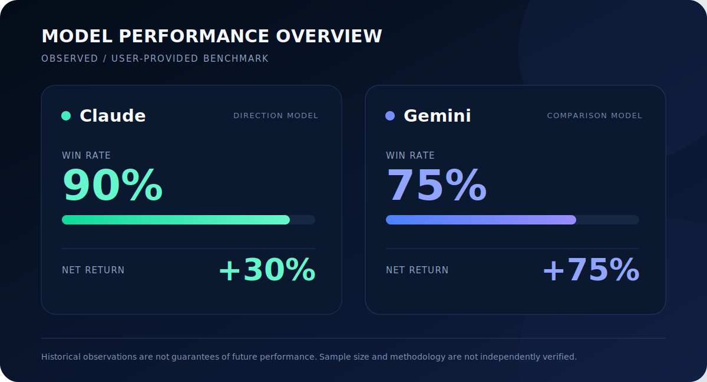
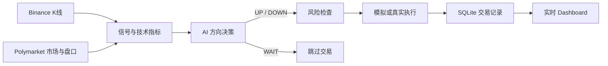

<div align="center">

# Polymarket BTC 15 分钟 AI 交易代理

**面向 Polymarket BTC 15 分钟二元市场的 AI 方向交易系统**

[English](README.md) · [打包说明](PACKAGING.md)


</div>

> [!WARNING]
> 本程序能够执行真实资金交易。首次运行务必使用
> `SIMULATION_MODE=true`。二元市场判断错误时，仓位本金可能全部损失。

## 模型胜率表现

<div align="center">
  
</div>

| 模型 | 观察方向胜率 | 当前状态 |
|---|---:|---|
| **Claude** | **90%** | 当前 Claude 兼容决策链路 |
| **Gemini** | **75%** | 对比观察数据；此版本未内置 Gemini 适配器 |

> 上述数据为用户提供的观察或测试结果，样本量、数据集、市场条件、费用和
> 统计方法尚未经过独立验证。这些数字不是审计结果、投资建议或未来收益保证。

## 项目简介

本项目监控 Polymarket BTC 15 分钟市场，综合 Polymarket 盘口、Binance
K 线和技术指标，由 AI 对最终结算方向作出 `UP`、`DOWN` 或 `WAIT`
决策。开仓后持有至二元结算：获胜代币结算为 `$1`，失败代币归零。

## 核心功能

- AI 判断最终结算方向，信心不足时主动 `WAIT`
- 支持模拟交易与 Polymarket 真实交易
- 支持置信度、最大交易额和滑点风险控制
- 自动发现、切换和结算每个 15 分钟市场
- Binance 1 分钟/5 分钟行情及多种技术指标
- SQLite 保存交易、仓位、AI 决策和结算记录
- 实时 Dashboard 展示账户、活动和完整 AI 推理
- 提供 Windows x64、Linux x64、macOS Universal 2 可执行文件

## 快速开始

### 使用 Release 可执行文件

1. 从 GitHub Releases 下载对应平台压缩包。
2. 将 `.env.example` 重命名为 `.env`。
3. 填写 `AI_API_KEY`，首次运行保持 `SIMULATION_MODE=true`。
4. 启动程序并访问 `http://127.0.0.1:4173`。

运行数据保存在可执行文件旁：

```text
data/simulation.db
data/live.db
logs/agent.log
```

### 从源码运行

```bash
npm install
cp .env.example .env
npm run build
npm start
```

Windows PowerShell：

```powershell
Copy-Item .env.example .env
```

## 配置参数

```env
AI_API_KEY=
SIMULATION_MODE=true
POLYMARKET_PRIVATE_KEY=
MAX_NOTIONAL_USD=5
CLAUDE_MODEL=claude-opus-4-1-20250805
```

| 参数 | 说明 |
|---|---|
| `AI_API_KEY` | 必填，AI 中转接口密钥 |
| `SIMULATION_MODE` | `true` 模拟交易，`false` 真实交易 |
| `POLYMARKET_PRIVATE_KEY` | 仅真实交易必填 |
| `MAX_NOTIONAL_USD` | 单笔订单最大名义金额 |
| `MIN_TRADE_CONFIDENCE` | 低于阈值时转换为 `WAIT` |
| `GLOBAL_PROXY_URL` | 可选 HTTP/HTTPS 代理 |

不要提交或发布包含密钥的 `.env` 文件。

## 打包可执行文件

```bash
npm run package:all
```

输出目录：

```text
release/windows-x64/
release/linux-x64/
release/macos-universal/
```

macOS Universal 2 同时支持 Intel 和 Apple Silicon。具体说明参见
[PACKAGING.md](PACKAGING.md)。

## 系统流程



## 安全与风险

- 真实交易请使用独立钱包，并仅存入有限资金。
- 私钥不得提交到源码仓库或打包进 Release。
- 开启真实模式前应确认代理、RPC 和 API 地址可信。
- AI 判断可能出错，网络延迟和行情变化也可能使决策失效。
- 本项目属于实验性软件，不构成投资建议。
